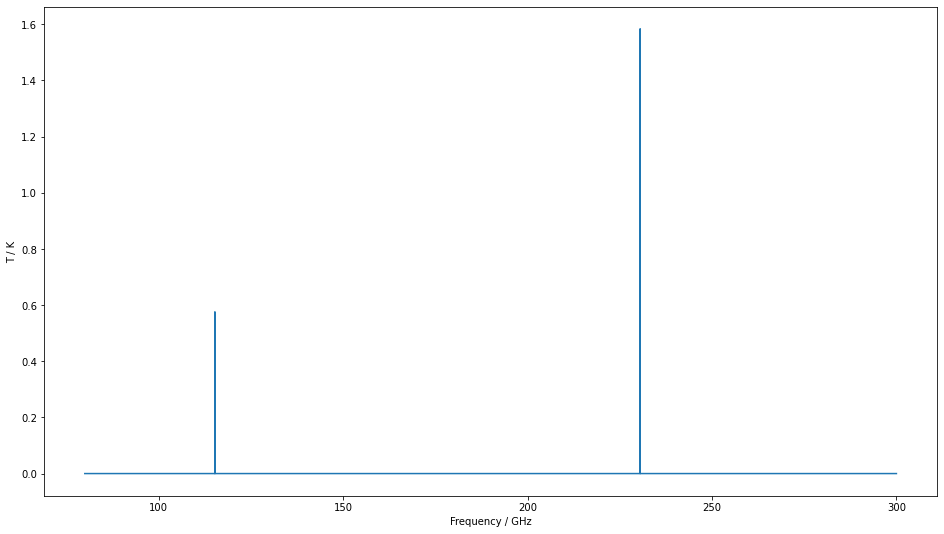
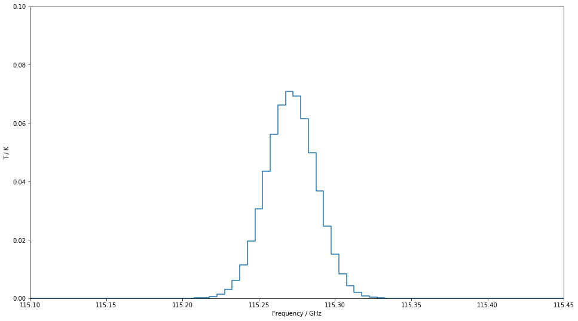

**Note:** This tutorial was generated from an IPython notebook that can be
downloaded `here <https://github.com/uclchem/SpectralRadex/tree/master/examples>`_.

.. _spectralmodelling:

Spectral Modelling
==================

One of SpectralRadex’s key features is the ability to generate model
spectra from RADEX models. In this example, we show how to generate a
spectrum.

.. code:: python

    import spectralradex
    import matplotlib.pyplot as plt
    import numpy as np

First, we need a radex model. This is just a dictionary with the RADEX
inputs as keys. For this example, we’ll start by grabbing the default
parameters from the radex wrapper. Then we’ll increase the CO column
density and the linewidth as well as setting fmax to 300 GHz.

.. code:: python

    radex_params=spectralradex.radex.get_default_parameters()
    
    radex_params["cdmol"]=1e16
    radex_params["p-h2"]=1e4
    radex_params["o-h2"]=1e4
    
    radex_params["linewidth"]=10
    radex_params["fmax"]=300
    
    print(radex_params)

.. parsed-literal::

    {'molfile': 'co.dat', 'tkin': 30.0, 'tbg': 2.73, 'cdmol': 1e+16, 'h2': 100000.0, 'h': 0.0, 'e-': 0.0, 'p-h2': 10000.0, 'o-h2': 10000.0, 'h+': 0.0, 'linewidth': 10, 'fmin': 0.0, 'fmax': 300}

We also need a list of frequencies over which we’d like the spectrum.
Here, we’ll generate a spectrum with a 5 MHz resolution between 80 and
300 GHz. Getting the model intensities is a simple function call which
will return a pandas dataframe of Frequency and Intensity.

The intention of SpectralRadex is to model observations. Thus, the first
two inputs to the spectral modelling function are intended to match some
observations: the frequency bins you observed and the assume
:math:`V_{LSR}` of the object.

.. code:: python

    frequencies=np.arange(80,300,0.005)
    v0=0.0
    spectrum=spectralradex.calculate_spectrum(frequencies,v0,radex_params)

.. code:: python

    fig,ax=plt.subplots(figsize=(16,9))
    ax.plot(spectrum["Frequency"],spectrum["Intensity"],drawstyle="steps-mid")
    settings=ax.set(xlim=(90,300.6),xlabel="Frequency / GHz",ylabel="T / K")

The above example shows two extremely narrow peaks but if we increase
the linewidth a little and zoom in, we can see the Gaussian shape we
assume for all line in SpectralRadex.

.. code:: python

    radex_params["linewidth"]=100
    spectrum=spectralradex.calculate_spectrum(frequencies,v0,radex_params)
    fig,ax=plt.subplots(figsize=(16,9))
    ax.plot(spectrum["Frequency"],spectrum["Intensity"],drawstyle="steps-mid")
    settings=ax.set(xlim=(115.1,115.45),ylim=(0,0.1),xlabel="Frequency / GHz",ylabel="T / K")

Finally, please note that if you sample with too large a frequency bin,
you’ll miss lines. We are still considering what the default behaviour
should be in this case. For now, SpectralRadex will warn you if the
velocity bins are larger than the linewidth.

Here we repeat the above calculation with a 50 MHz frequency spacing.

.. code:: python

    frequencies=np.arange(30,300,0.05)
    v0=0.0
    spectrum=spectralradex.calculate_spectrum(frequencies,v0,radex_params)
    fig,ax=plt.subplots(figsize=(16,9))
    ax.plot(spectrum["Frequency"],spectrum["Intensity"],drawstyle="steps-mid")
    settings=ax.set(xlim=(90,300.6),xlabel="Frequency / GHz",ylabel="T / K")

.. image:: spectralmodelling_files/spectralmodelling_11_0.png

